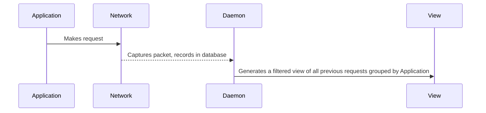

# android_cap

## Solution Flow

[](https://mermaid-js.github.io/mermaid-live-editor/#/edit/eyJjb2RlIjoic2VxdWVuY2VEaWFncmFtXG4gIHBhcnRpY2lwYW50IEEgYXMgQXBwbGljYXRpb25cbiAgcGFydGljaXBhbnQgTiBhcyBOZXR3b3JrXG4gIHBhcnRpY2lwYW50IEQgYXMgRGFlbW9uXG4gIHBhcnRpY2lwYW50IFYgYXMgVmlld1xuXG4gIEEgLT4-IE46IE1ha2VzIHJlcXVlc3RcbiAgTiAtLT4-IEQ6IENhcHR1cmVzIHBhY2tldCwgcmVjb3JkcyBpbiBkYXRhYmFzZVxuICBEIC0-PiBWOiBHZW5lcmF0ZXMgYSBmaWx0ZXJlZCB2aWV3IG9mIGFsbCBwcmV2aW91cyByZXF1ZXN0cyBncm91cGVkIGJ5IEFwcGxpY2F0aW9uXG4iLCJtZXJtYWlkIjp7InRoZW1lIjoiZGVmYXVsdCJ9LCJ1cGRhdGVFZGl0b3IiOmZhbHNlfQ)
