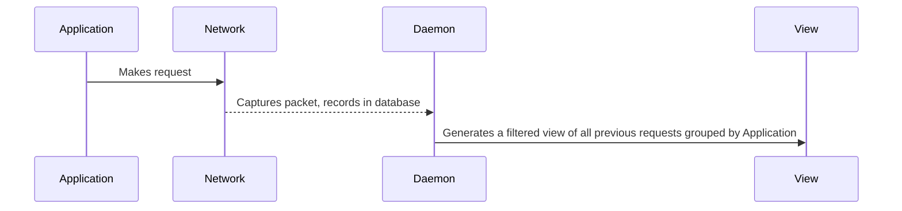

# android_cap

## Solution Flow

```mermaid
sequenceDiagram
  participant A as Application
  participant N as Network
  participant D as Daemon
  participant V as View

  A ->> N: Makes request
  N -->> D: Captures packet, records in database
  D ->> V: Generates a filtered view of all previous requests grouped by Application
```
